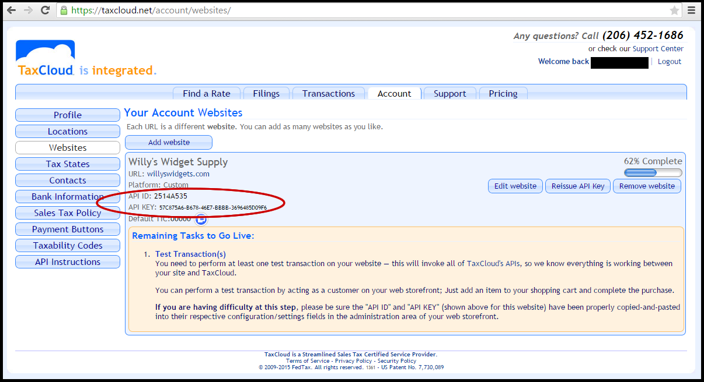

#TaxCloud for Zen Cart v1.5+#

[TaxCloud®](http so://TaxCloud.net) is a free, easy-to-use sales tax management service for retailers. Our free add-on module integrates with Zen Cart version 1.5 and above. This module overrides Zen Cart’s built-in tax calculation and replaces it with a real-time tax rate lookup.
##How TaxCloud works##
After a customer has entered a shipping address during checkout, Zen Cart sends TaxCloud a request to calculate the sales tax due. TaxCloud returns that information to Zen Cart, and sales tax is added to the customer’s total. Once the order is completed, another request is sent to TaxCloud to capture the transaction. All the captured transactions are included in the report that TaxCloud provides at the end of each month.
##Preparation##
Here’s what you’ll need to do:

1. [Register for your free TaxCloud account](https://taxcloud.net/account/register/).

2. You will receive an email with a link to confirm creation of your new account, and set you account password.	

3. Next, log into your new TaxCloud account and:
  - Provide you company's basic information (Legal Name, Employer Identification Number, NAICS code, State of Incorporation) in the account Profile area
  - Enter your office address in the [Locations area](https://taxcloud.net/account/locations/).
  - Select any additional states where you want to collect sales tax in the [Tax States area](https://taxcloud.net/account/states/).

4. Find your TaxCloud API ID and API Key in the [Websites area](https://taxcloud.net/account/websites/). Each website you setup in this area will have it's own unique API credentials, so you can have one production site (with live transactions), and other development and testing websites that are not live (thus, will not be included in your sales tax reports).

*Note: API IDs and API Keys for each website are generated automatically. Please do not share them with anyone or use them for multiple URLs.*

5. **This implementation requires PHP version 5.0 or above**. Most servers have a phpInfo file that displays the version of PHP in your environment.

6. **SOAP and cUrl must be enabled**. Again, the phpInfo file will display this information.

7. **A USPS Web Tools Username**. This allows TaxCloud to verify the customer’s address and obtain the 9-digit zip code. The importance of this last setting is minimal because TaxCloud suspended use of the USPS APIs because their servers had degraded reliability over the last few years.

##Installation##
- Download the contents of this repository into a temporary directory on your server.
- Be sure to back up your Zen Cart installation before you start making changes.
- **Disable and/or remove any other sales tax modules before installing TaxCloud**
- Copy the contents of the downloaded TaxCloud source into the respective locations in your Zen Cart installation.

  *Note:  as a part of the Zen Cart installation you are prompted to rename the "admin" directory. Since we cannot predict how you have renamed your admin folder, you must take care to copy the files from the TaxCloud "admin" directory into your renamed directory.*

##Configuration##
Once the module is installed, log in to Zen Cart and navigate to Locations/Taxes >> TaxCloud Tax Calculation. Select this menu item to go to the TaxCloud administration page.

Click “Update” to configure your TaxCloud settings as follows:
- **API ID**: Enter the API ID for your website (see above).
- **API Key**: Enter the API Key for your website (see above).
- USPS ID: As described above, TaxCloud no longer requires an actual USPS WebTools User ID. You can use a placeholder/fake USPS ID of ''111CLOUD1111'' to pass any syntax verifications.
- **Store Street Address**: Enter ONLY the first line of your business’s street address—for example, “100 Front Street.”
- **Store Zip Code**: Enter your business’s 5-digit zip code. 
- **TaxCloud Eenabled**: Check this box to enable TaxCloud. If you later need to disable TaxCloud for any reason, simply uncheck this box.
Once you’ve entered this information, you should see this message “Server is configured to reach TaxCloud” - this means your ZenCart/PHP/SOAP/cUrl stack is fully functional, and your API ID and API Key are working.

**Important Configuration Setting: States must be abbreviated**.
This can be easily achieved by enabling "Show states as pulldown". This ensures that only two-character abbreviations are sent to TaxCloud. If full state names are sent, then the state will be truncated to the first tow characters, which will cause lots of problems because Pennsylvania will not exist (PE), and Minnesota will seen as Michigan (MI). To set this Zen Cart setting:
- In your Zen Cart Admin console, browse to Configuration >> Customers Details
- Find the “State – Always display as pulldown?” and select “true”

##Assigning Tax Classes##
Each item in your store needs to be assigned a Taxability Information Code or TIC, so TaxCloud can determine whether or not that item is taxed in your customer’s state. These are stored in ZenCart using the “Tax Classes” section. You should set up at least the General Goods and Services tax class, TIC ''00000'', which is used to designate items that are taxable in every state. For the complete list of TICs with documentation, please see [https://taxcloud.net/tic/](https://taxcloud.net/tic/).

To add a new tax class/TIC:

1. In your Zen Cart Admin console, go to Locations/Taxes >> Tax Classes.

2. Click the “New Tax Class” button.

3. Enter the TIC number in the “Tax Class Title” field and a description in the “Description” field.

4. Click the “insert” button. 

Once the TIC is created, go to your catalog and assign it to your products:

1. Select a product by going to Catalog > Categories/Products.

2. Browse to the product you would like to edit.

3. Select the appropriate tax class from the “Tax Class” drop-down.

4. Save your changes.

**Shipping Taxability Advisory**
The appropriate Shipping charges TIC is usually ''11010'' if you are using a Real-Time-Shipping service and you **do not markup shipping**. However, if you charge flat-rate shipping, or markup your shipping cost such that you are charging your customers more than your actual shipping cost, you should use the Shipping & Handling TIC ''11000''.

To add your appropriate Shipping tax class/TIC:

1. In your Zen Cart Admin console, go to Locations/Taxes >> Tax Classes.

2. Click the “New Tax Class” button.

3. Enter ''11010'' or ''11000'' in the “Tax Class Title” field and set the description in the “Description” field either ''Shipping'' or ''Shipping and Handling''

4. Click the “insert” button. 

If you are manually configuring shipping, be sure you set the Tax Class to the appropriate TIC, and set the Tax Basis to "Shipping."

##Testing##
Once you have completed these steps, try some test transactions to make sure everything is working correctly. Make sure to complete at least one test order. The test order must be purchased, it’s not enough to just add an item to your cart.

To review your test transactions, log in to the TaxCloud website and click on the “Transactions” tab. Click on any transaction to see more details about that order. 

##Going Live##
TaxCloud is in 'test mode' until you set your website to **live** within TaxCloud. When you’re ready to go live, login to TaxCloud, go to the “Websites” are, and click the “Go Live!” button. If you do not see a “Go Live!” button, you’ll see a message telling you what you need to do in order to go live.

##Exemption Certificates##
We also provide support for Exemption Certificates. If the customer qualifies for a tax exemption and they fill out the included form the exemption certificate will be created and stored on TaxCloud. The customer can then apply the exemption to their shopping cart which will remove the taxes from the total. Multiple exemption certificates can be stored per customer and retrieved each time the customer logs in.

This functionality is available as an order total module. If you would like to use this module it will need to be enabled in your Zen Cart admin console.

1. Go to Modules >> Order Total
2. Select Exemption Certificates, and click the “Install” button.

This will add a link to the checkout page that says “Are you exempt?” [See this example](http://taxcloud.net/imgs/cert_sample.html).

##Coupons##
Zen Cart includes a built-in module for managing coupons. Unfortunately this default coupon module does not handle coupons and sales tax correctly - it applies coupons *after* tax calculation, which is **incorrect.** This is because coupons and discounts affect the Sales Price (the legal term for the amount to be paid by the customer). Accordingly, sale tax calculation must be done **after** application of discounts or coupons. To solve this issue, we have provided a custom Discount Coupon module that replaces the standard one. If you are planning to use discount coupons on your site, you should **disable the standard Discount Coupon module** in the Zen Cart admin console by going to Modules >> Order Total. Then, select the TaxCloud version of Discount Coupon, and click the “Install” button.

----------------------------------------------------
This code is released under the GNU GENERAL PUBLIC LICENSE (see [License](LICENSE.md))

Copyright (c) 2015 The Federal Tax Authority, LLC (FedTax). Information subject to change without notice.

This program is free software; you can redistribute it and/or modify it under the terms of the GNU General Public License as published by the Free Software Foundation; either version 2 of the License, or (at your option) any later version.

This program is distributed in the hope that it will be useful, but WITHOUT ANY WARRANTY; without even the implied warranty of MERCHANTABILITY or FITNESS FOR A PARTICULAR PURPOSE.  See the [GNU General Public License](LICENSE.md) for more details.
